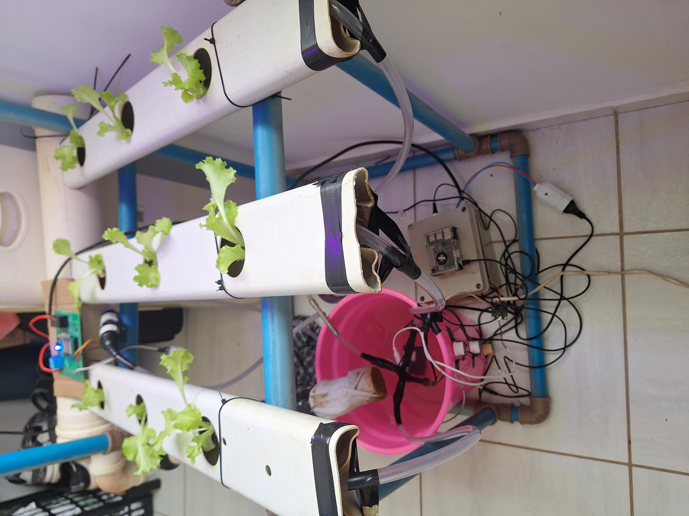
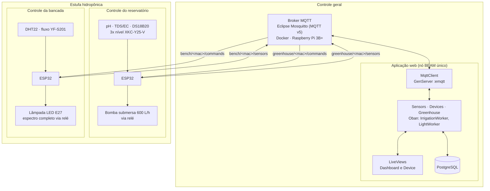
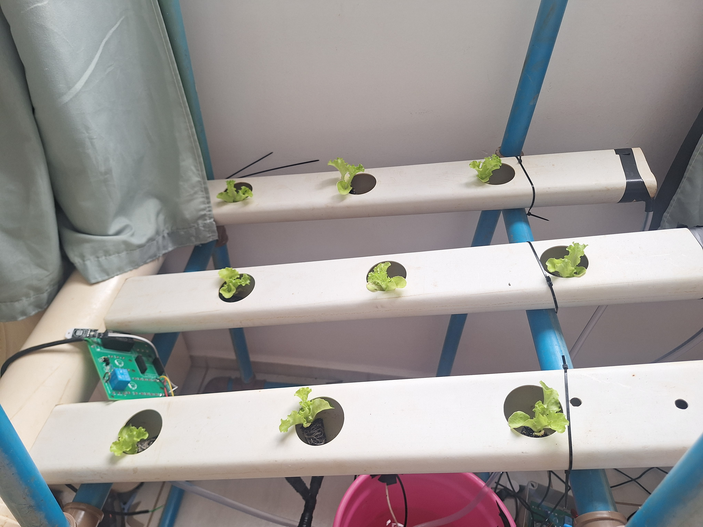
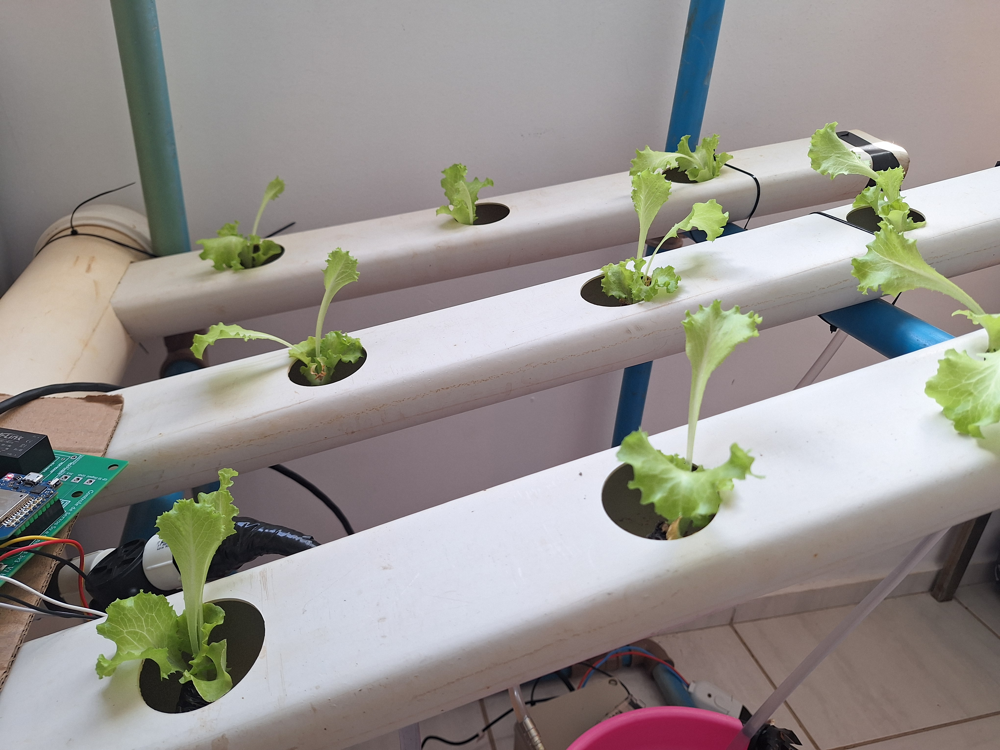

# Sistema de Monitoramento e Atuação Automático para Produção Hidropônica

Monitoramento e automação de cultivo hidropônico NFT com módulos ESP32, broker MQTT e aplicação web em Phoenix LiveView.

## Visão geral

Na técnica NFT, uma lâmina fina de solução nutritiva circula continuamente pelas raízes, e o cultivo depende de variáveis que mudam ao longo do dia: pH, condutividade elétrica, temperatura da solução, temperatura e umidade do ar, vazão e fotoperíodo. Em pequena escala, o acompanhamento é feito por medições manuais esporádicas, com bomba e iluminação em timer e sem registro histórico.

Este sistema mede essas variáveis a cada 15 segundos, grava a série histórica em banco, exibe as leituras em tempo real na web e aciona bomba e lâmpada por cronogramas configuráveis.

Custo aproximado: R$ 195,06 por módulo de reservatório e R$ 98,57 por bancada, cerca de R$ 293 para um sistema com um reservatório e uma bancada.



_Protótipo em operação: canais NFT em PVC, reservatório com a bomba e as sondas, módulo ESP32 da bancada no alto e caixa de passagem com o relé._

## Arquitetura

Três níveis, ligados por MQTT:



O broker é o único ponto de encontro entre firmware e servidor: os ESP32 não conhecem o endereço da aplicação nem ela o deles, ambos falam com `hidroponia.local:1883`.

Cliente MQTT, regras de negócio, jobs agendados e processos LiveView rodam no mesmo nó BEAM. Uma leitura que chega pelo `MqttClient` é gravada pelo contexto `Sensors` e propagada por `Phoenix.PubSub` direto para os LiveViews conectados, sem API REST intermediária.

Um detalhe do esquema de tópicos: bancadas não carregam o identificador da estufa. A vinculação entre bancada e estufa fica no banco (`devices.greenhouse_id`, editável pela interface), então mover um módulo de bancada para outra estufa não exige recompilar firmware.

## Hardware

**Módulo do reservatório** (diagrama: `Imagens/DiagramaReservatorioAnotado.png`)

| Componente                 | Função                                                     |
| -------------------------- | ---------------------------------------------------------- |
| ESP32 (MH-ET Live MiniKit) | Leitura dos sensores, publicação MQTT, acionamento do relé |
| Sensor de pH PH-4502C      | pH da solução nutritiva                                    |
| TDS Meter V1.0             | Condutividade elétrica da solução, em µS/cm                |
| DS18B20                    | Temperatura da solução, usada na compensação de pH e EC    |
| 3x XKC-Y25-V               | Nível capacitivo sem contato, sem furar o reservatório     |
| Módulo relé                | Chaveamento da bomba                                       |
| Bomba submersa 600 L/h     | Circulação da solução pelos canais NFT                     |
| Fonte Hi-Link 5 V          | Alimentação a partir da rede                               |

Total do módulo: **R$ 195,06**

**Módulo da bancada** (diagrama: `Imagens/DiagramaBancadaAnotado.png`)

| Componente                           | Função                                                     |
| ------------------------------------ | ---------------------------------------------------------- |
| ESP32 (MH-ET Live MiniKit)           | Leitura dos sensores, publicação MQTT, acionamento do relé |
| DHT22                                | Temperatura e umidade do ar                                |
| YF-S201                              | Vazão na bancada, por contagem de pulsos em interrupção    |
| Módulo relé                          | Chaveamento da lâmpada                                     |
| Lâmpada LED E27 de espectro completo | Iluminação suplementar                                     |
| Fonte Hi-Link 5 V                    | Alimentação a partir da rede                               |

Total do módulo: **R$ 98,57**

Pinos e constantes de calibração ficam no `include/config.hpp` de cada firmware. Esquemas em Fritzing: `DiagramaBancada.fzz` e `Imagens/DiagramaReservatorio.fzz`.

## Stack

**Firmware:** C++ sobre o framework Arduino, compilado com PlatformIO para a board `mhetesp32minikit`, com PubSubClient, ArduinoJson, DallasTemperature (reservatório) e DHT sensor library (bancada).

**Aplicação:** Elixir 1.15 com Phoenix 1.8, LiveView 1.1 e Bandit; PostgreSQL via Ecto, cronogramas no Oban, gráficos em ECharts, estilo em Tailwind e `emqtt` 1.14.4 como cliente MQTT (v5).

**Infraestrutura:** Eclipse Mosquitto e PostgreSQL 15 em Docker Compose, num Raspberry Pi 3B+. O broker escuta MQTT na 1883 e WebSockets na 9001.

## Estrutura do repositório

```
.
├── SistemaReservatorio/   firmware do reservatório: src/, include/, platformio.ini, Makefile
├── SistemaBancada/        firmware da bancada, mesma organização
├── sistema_controle/      aplicação Phoenix: lib/, assets/, priv/, mosquitto/, docker-compose.yml
└── Imagens/               diagramas, esquemas Fritzing e fotos do protótipo
```

## Como executar

### Pré-requisitos

- Elixir 1.15+ e Erlang/OTP compatível
- Docker e Docker Compose
- PlatformIO Core (`pio`) para os firmwares
- Um host acessível como `hidroponia.local` na rede local, onde roda o broker

### Broker MQTT e banco

Os dois sobem pelo Compose em `sistema_controle/`:

```bash
cd sistema_controle
docker compose up -d
```

O `mosquitto.conf` usa `allow_anonymous false` e exige `/mosquitto/config/password.txt`, que não é versionado. Crie o arquivo com o usuário do firmware e do servidor:

```bash
docker compose exec mosquitto mosquitto_passwd -c /mosquitto/config/password.txt hidroponia
docker compose restart mosquitto
```

O PostgreSQL sobe com banco `hidroponia_db`, usuário `hidroponia_user` e senha `123456`, iguais aos de `config/dev.exs`. Para trocar, defina `POSTGRES_DB`, `POSTGRES_USER` e `POSTGRES_PASSWORD` antes do `up` e ajuste o `dev.exs`.

### Aplicação web

```bash
cd sistema_controle
mix setup        # deps.get, ecto.create, ecto.migrate, seeds, assets.setup, assets.build
mix phx.server   # ou: iex -S mix phx.server
```

A interface fica em http://localhost:4000. Em desenvolvimento o endpoint escuta só em `127.0.0.1`; para acessar de outra máquina, troque `ip: {127, 0, 0, 1}` por `ip: {0, 0, 0, 0}` em `config/dev.exs`. O alias `mix precommit` compila com `--warnings-as-errors`, formata e roda os testes.

### Firmwares

Cada módulo é um projeto PlatformIO independente. Ajuste `include/config.hpp` com SSID, senha do Wi-Fi e credenciais do broker; os valores versionados são os do ambiente de testes. O endereço do broker também está em `sistema_controle/lib/sistema_controle/mqtt_client.ex` e precisa bater nos três arquivos.

```bash
cd SistemaReservatorio        # ou SistemaBancada
make upload ENV=mhetesp32minikit
make monitor                  # serial a 115200 baud
```

Em PlatformIO puro:

```bash
pio run -t upload --environment mhetesp32minikit
pio device monitor -b 115200
```

`make erase ENV=mhetesp32minikit` apaga a flash; `make compiledb ENV=mhetesp32minikit` regenera o `compile_commands.json` do clangd.

A calibração do pH usa a reta de `PH_CALIBRATION_A` e `PH_CALIBRATION_B`, em `config.hpp`. A função `calibrate_ph()` imprime ADC e tensão médios para levantar os dois pontos com soluções tampão.

## Protocolo MQTT

O identificador no tópico é o MAC retornado por `WiFi.macAddress()`, no formato `AA:BB:CC:DD:EE:FF`.

| Tópico                      | Sentido          | Conteúdo                              |
| --------------------------- | ---------------- | ------------------------------------- |
| `greenhouse/<mac>/sensors`  | ESP32 → servidor | Leituras do reservatório, a cada 15 s |
| `greenhouse/<mac>/commands` | Servidor → ESP32 | Acionamento da bomba                  |
| `bench/<mac>/sensors`       | ESP32 → servidor | Leituras da bancada, a cada 15 s      |
| `bench/<mac>/commands`      | Servidor → ESP32 | Acionamento da lâmpada                |

O servidor assina `greenhouse/+/sensors` e `bench/+/sensors` com QoS 0; cada firmware assina só o próprio tópico de comandos.

Leitura do reservatório, publicada em `greenhouse/AA:BB:CC:DD:EE:FF/sensors`:

```json
{
  "ph": 6.12,
  "ec": 1184.37,
  "temp": 23.68,
  "levels": { "level0": true, "level1": true, "level2": false },
  "pump": true,
  "ts": 1358230
}
```

`ec` é a condutividade em µS/cm. O firmware aplica a curva do TDS Meter (`133.42·V³ − 255.86·V² + 857.39·V`) sobre a tensão já compensada em temperatura, sem multiplicar pelo fator TDS de 0,5, então o valor publicado é condutividade e não sólidos dissolvidos em ppm. Os três níveis são booleanos de presença de água em alturas diferentes do reservatório. `ts` é o `millis()` da placa, não um horário absoluto: o registro temporal é o `inserted_at` gravado pelo servidor.

Leitura da bancada, publicada em `bench/AA:BB:CC:DD:EE:FF/sensors`:

```json
{
  "flow": 1.87,
  "air_temp": 26.4,
  "air_humidity": 62.1,
  "light": false,
  "ts": 1358430
}
```

Comandos, publicados pelo servidor:

```json
{ "atuador": "bomba", "valor": true }
```

```json
{ "atuador": "luz", "valor": true }
```

O firmware do reservatório só reage a `"atuador": "bomba"`, e o da bancada só a `"atuador": "luz"`. Outros valores são registrados no serial e ignorados.

Cadastro automático: ao receber mensagem de um MAC desconhecido, `Devices.create_or_update_device/2` cria o registro, nomeia como "Estufa N" ou "Bancada N" e, para estufas, cria a configuração padrão. Ligar um módulo novo na rede basta para ele aparecer na interface.

## Resultados

O sistema foi validado em um cultivo real de alface crespa.

| 05/11/2025                                                                          | 12/11/2025                                                                                |
| ----------------------------------------------------------------------------------- | ----------------------------------------------------------------------------------------- |
|  |  |
| Mudas recém-transplantadas, no início do monitoramento                              | As mesmas posições após uma semana de operação contínua                                   |

Durante o ciclo, foram verificados:

- Telemetria dos dois módulos a cada 15 segundos, com série histórica persistida e visualização em tempo real
- Cadastro automático de módulos na primeira publicação
- Troca de uma bancada entre estufas pela interface, sem regravar firmware
- Cronogramas de bomba e lâmpada por janela de horário, dias da semana e ciclos liga/desliga em minutos
- Acionamento manual pela interface, com retorno do estado na leitura seguinte

**Limitação conhecida do sensor de pH.** O sensor de pH e o sensor de EC compartilham a mesma solução e o mesmo referencial de terra, e a excitação do eletrodo de EC injeta corrente na água que desloca a leitura do eletrodo de pH. A mitigação adotada é digital: `read_ph()` coleta 50 amostras, ordena o vetor e faz a média apenas do quartil central, descartando os extremos; a mesma filtragem é aplicada ao EC com 30 amostras, e ambas as leituras recebem compensação de temperatura a partir do DS18B20. A filtragem reduz o ruído, mas não elimina o desvio: a interferência eletroquímica permanece e a leitura de pH deve ser tratada como indicativa, com conferência periódica por medição manual. A solução definitiva passa por isolamento galvânico entre as sondas ou por alternar a excitação dos dois sensores no tempo.

## Publicação

Trabalho de conclusão de curso em Ciência da Computação, Faculdade de Computação (FACOM) da Universidade Federal de Mato Grosso do Sul (UFMS), 2025. Publicado nos anais do VII Congresso Brasileiro Interdisciplinar em Ciência e Tecnologia (COBICET), 2026.

> CÁCERES, Camila Cardoso; JUNQUEIRA, Luiz Gustavo S. S. **Sistema automático de monitoramento e atuação para produção hidropônica**. In: CONGRESSO BRASILEIRO INTERDISCIPLINAR EM CIÊNCIA E TECNOLOGIA, 7., 2026. Anais [...]. Even3, 2026.

https://www.even3.com.br/anais/cobicet2026-628540/1606975-sistema-automatico-de-monitoramento-e-atuacao-para--producao-hidroponica

## Autores

- Camila Cardoso Cáceres
- Luiz Gustavo S. S. Junqueira

Orientação: Profa. Hana Karina Salles Rubinsztejn (FACOM/UFMS).
